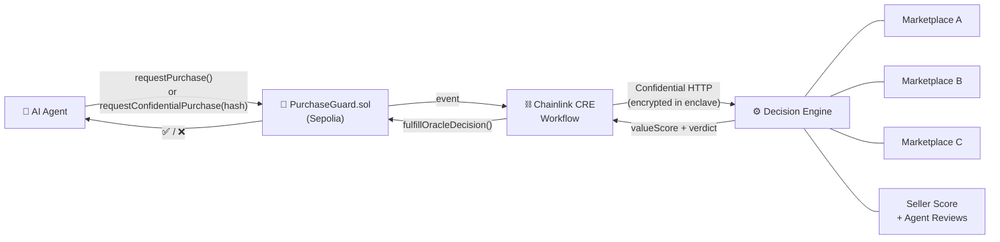

# ValueOracle

**AI agents can spend money, but they cannot verify value. We built the missing trust layer for agent commerce.**

ValueOracle is a verifiable commerce oracle powered by Chainlink CRE that protects autonomous agents from overpaying, fraud, and price manipulation. Think of Chainlink price feeds — but for real-world product decisions.

---
## Links

**Live Website:** https://valueoracle.com 
**YouTube Demo:** https://youtu.be/dYp4lH2XHhc 
**Decision API (Railway):** https://valueoracle-api.up.railway.app  
**API Health:** https://valueoracle-api.up.railway.app/health  
**Live Demo:** https://valueoracle.com/#demo


> Built for [Convergence: A Chainlink Hackathon](https://chain.link/hackathon) — CRE & AI + Privacy Tracks
---

## Problem

Autonomous AI agents can initiate transactions, but they lack economic reasoning:

- They **cannot compare** market prices across sources
- They **cannot detect** price manipulation or outliers
- They **cannot verify** seller trustworthiness

This creates unacceptable financial risk in agent-driven commerce.

## Solution

ValueOracle acts as a **decision oracle** between an agent's purchase intent and the actual transaction. Before any funds move, the oracle:

1. Aggregates prices from multiple marketplace sources
2. Detects outliers and manipulation
3. Scores seller reputation
4. Returns a verifiable **approve/reject** decision onchain

```
Financial Oracle → token price
ValueOracle     → real-world purchase decision
```

## Architecture


```mermaid
flowchart LR
    Agent["🤖 AI Agent"]
    Contract["📜 PurchaseGuard.sol\n(Sepolia)"]
    CRE["⛓️ Chainlink CRE\nWorkflow"]
    Engine["⚙️ Decision Engine"]
    MA["Marketplace A"]
    MB["Marketplace B"]
    MC["Marketplace C"]
    SS["Seller Score\n+ Agent Reviews"]

    Agent -->|"requestPurchase()\nor requestConfidentialPurchase(hash)"| Contract
    Contract -->|"event"| CRE
    CRE -->|"Confidential HTTP\n(encrypted in enclave)"| Engine
    Engine --- MA
    Engine --- MB
    Engine --- MC
    Engine --- SS
    Engine -->|"valueScore + verdict"| CRE
    CRE -->|"fulfillOracleDecision()"| Contract
    Contract -->|"✅ / ❌"| Agent
```

**Flow:**
1. Agent submits purchase intent → `PurchaseGuard.sol`
2. Contract emits `PurchaseRequested` event
3. Chainlink CRE workflow triggers, fetches external data
4. Decision engine evaluates price fairness
5. Oracle returns signed result → contract approves or rejects

## Tech Stack

| Component | Technology |
|---|---|
| Smart Contract | Solidity (Sepolia) |
| Contract Address | [`0xfDB5020163742C340AAebAade840078CC557e1a1`](https://sepolia.etherscan.io/address/0xfDB5020163742C340AAebAade840078CC557e1a1) |
| Oracle Layer | Chainlink CRE |
| Privacy | Confidential HTTP (TS SDK, enclave) + Commit-Reveal |
| Decision API | Node.js |
| Agent Trigger | CLI / Script |
| Data Sources | Mock marketplace APIs |

## Project Structure

```
ValueOracle/
├── contracts/
│   └── PurchaseGuard.sol          # ← Chainlink oracle consumer (standard + confidential)
├── cre/
│   └── workflow.yaml              # ← CRE workflow reference spec
├── valueoracle-cre/               # ← TypeScript CRE workflow (PRIVACY IMPLEMENTATION)
│   ├── secrets.yaml               # Vault DON secrets (API key + AES encryption key)
│   └── purchase-guard/
│       ├── main.ts                # ← TS workflow: HTTPClient + ConfidentialHTTPClient
│       ├── config.staging.json    # Workflow config (API URL, contract, chain selector)
│       └── workflow.yaml          # CRE CLI target settings
├── api/
│   ├── server.js                  # Decision engine API
│   └── sources/                   # Marketplace data adapters
├── agent/
│   └── cli.js                     # Agent CLI (buy, buy-private, reveal, review)
├── scripts/
│   ├── deploy.js                  # Contract deployment
│   └── simulate.js                # End-to-end API simulation (6 scenarios)
├── test/
│   └── PurchaseGuard.test.js      # 23 tests
└── website/
    └── index.html                 # Live demo page
```

## Chainlink Integration Files

> Required by hackathon: links to all files that use Chainlink

| File | Purpose |
|---|---|
| [`contracts/PurchaseGuard.sol`](./contracts/PurchaseGuard.sol) | Smart contract with standard + confidential purchase modes |
| [`valueoracle-cre/purchase-guard/main.ts`](./valueoracle-cre/purchase-guard/main.ts) | **TS CRE workflow — `ConfidentialHTTPClient` for enclave-based privacy** |
| [`valueoracle-cre/secrets.yaml`](./valueoracle-cre/secrets.yaml) | Vault DON secrets config (API key + AES encryption key) |
| [`cre/workflow.yaml`](./cre/workflow.yaml) | CRE workflow reference spec — standard HTTP + Confidential HTTP flows |
| [`valueoracle-cre/purchase-guard/workflow.yaml`](./valueoracle-cre/purchase-guard/workflow.yaml) | CRE CLI workflow settings (staging/production targets) |
| [`api/server.js`](./api/server.js) | Decision engine with `/evaluate` and `/evaluate-confidential` endpoints |
| [`scripts/simulate.js`](./scripts/simulate.js) | End-to-end API simulation (6 scenarios) |

## Quick Start

```bash
# Clone
git clone https://github.com/LeventLabs/ValueOracle.git
cd ValueOracle

# Install dependencies
npm install

# Deploy contract (Sepolia)
npx hardhat run scripts/deploy.js --network sepolia

# Start decision API
node api/server.js

# Run end-to-end API simulation (6 scenarios)
node scripts/simulate.js

# Run CRE workflow simulation (requires CRE CLI)
cd valueoracle-cre
cre workflow simulate ./purchase-guard --non-interactive --trigger-index 0 \
  --evm-tx-hash <TX_HASH> --evm-event-index 0
cd ..

# Demo: Agent attempts fair purchase (approved)
node agent/cli.js buy laptop-001 --price 1100 --seller seller-42

# Demo: Agent attempts overpriced purchase (rejected)
node agent/cli.js buy laptop-001 --price 2500 --seller seller-42

# Demo: Confidential purchase (privacy mode)
node agent/cli.js buy-private laptop-001 --price 1100 --seller seller-42
```

## Decision Logic

```
effectivePrice = proposedPrice - cashback - coupon + shippingFee

valueScore = priceFairness × 0.35 + qualitySignal × 0.25 + sellerTrust × 0.25 + valueRatio × 0.15

score >= 70         → ✅ APPROVE
score 40-69         → ⚠️ CAUTION (rejected)
score < 40          → ❌ REJECT
sellerScore < 0.4   → ❌ BLOCKED (regardless of score)
```

The engine calculates an effective price by factoring in cashback, coupons, and shipping fees before scoring. This means a slightly overpriced listing with a good coupon can still be approved.

## Demo Scenarios

| Scenario | Price | Eff. Price | Ref Price | Seller | Reviews | Score | Result |
|---|---|---|---|---|---|---|---|
| Fair purchase | $1,100 | $1,048 | $1,095 | seller-42 (0.88) | 3 (4.67/5) | 95 | ✅ Approved |
| Overpriced | $2,500 | $2,448 | $1,095 | seller-42 (0.88) | 3 (4.67/5) | 68 | ❌ Rejected (price) |
| Untrusted seller | $1,000 | $948 | $1,095 | seller-99 (0.30) | 1 (1.33/5) | 81 | ❌ Blocked (trust) |
| Low quality item | $25 | $30 | $11 | seller-200 (0.15) | — | 27 | ❌ Blocked (trust) |
| Good deal | $280 | $274 | $295 | seller-100 (0.92) | 2 (4.50/5) | 95 | ✅ Approved |
| Coupon saves it | $950 | $910 | $899 | seller-42 (0.88) | 3 (4.67/5) | 93 | ✅ Approved |

## CRE Workflow Simulation

The TypeScript workflow uses `EVMClient.logTrigger` to listen for both `PurchaseRequested` and `ConfidentialPurchaseRequested` events on Sepolia.

- **Standard purchases:** Uses `HTTPClient` — nodes reach consensus on the API response.
- **Confidential purchases:** Uses `ConfidentialHTTPClient` — request executes inside a secure enclave with Vault DON secret injection and AES-GCM response encryption.

```
$ cd valueoracle-cre
$ cre workflow simulate ./purchase-guard --non-interactive --trigger-index 0 \
  --evm-tx-hash 0xe7cd7bf8...407f08 --evm-event-index 0

✓ Workflow compiled
[USER LOG] Purchase request detected: requestId=0xb363b115... item=laptop-001 price=$1100 seller=seller-42
[USER LOG] Purchase evaluation complete: requestId=0xb363b115... | verdict=APPROVE | score=95 | ref=$1095 | eff=$1048 | reason="Fair price and trusted seller"
✓ Workflow Simulation Result: "APPROVE: score 95/100"

# Confidential purchase simulation (trigger-index 1):
$ cre workflow simulate ./purchase-guard --non-interactive --trigger-index 1 \
  --evm-tx-hash 0xc118a490...570c4 --evm-event-index 0

✓ Workflow compiled
[USER LOG] Confidential purchase detected: requestId=0xc4c81f1539... intentHash=0x086c4fb469...
[USER LOG] Confidential response received (encrypted): requestId=0xc4c81f1539... bodyLength=313
✓ Workflow Simulation Result: "CONFIDENTIAL_RESULT: requestId=0xc4c81f1539... encrypted_len=313"
```

## Live Demo

[Open interactive demo](https://valueoracle.com/#demo)
[Watch YouTube demo](https://youtu.be/dYp4lH2XHhc)

The demo shows:
1. Agent submits purchase intent
2. CRE workflow triggers and fetches marketplace data
3. Oracle produces verifiable decision
4. Smart contract approves or rejects the transaction onchain


## Why This Matters — The Post-SaaS Agent Economy

AI agents are rapidly commoditizing every SaaS tool. They auto-switch providers, negotiate prices, and collapse 30 dashboards into a single chat. Switching costs are gone. Brand loyalty is gone. Margins are racing to zero.

But there's one thing agents **cannot** automate: **trust**.

An agent can move your database from Supabase to Neon overnight. It can cancel your Stripe and set up a competitor. But when it comes to *spending money* — comparing prices across sources, detecting manipulation, verifying seller reputation — it's flying blind.

**ValueOracle is the missing trust layer for this new economy.**

Just as Stripe's fraud detection gets smarter with every transaction across millions of businesses, ValueOracle builds collective commerce intelligence across every agent decision. More agents → better data → smarter decisions → more agents. That's a moat AI agents can't commoditize.

> In a world where agents automate everything, the infrastructure that makes agents *trustworthy* becomes the most valuable layer of all.

## Privacy Layer

ValueOracle implements genuine privacy using **Chainlink Confidential HTTP** (TypeScript CRE SDK `ConfidentialHTTPClient`) and a **commit-reveal pattern**. This prevents competing agents from front-running purchase decisions.

**Why privacy matters in agent commerce:**
- Competing agents can monitor `PurchaseRequested` events and front-run deals
- Marketplace API keys exposed in node memory = security risk
- Seller manipulation: if sellers see incoming purchase intents, they can raise prices

**How it works (with actual Confidential HTTP):**

```
Standard:  Agent → itemId + price + sellerId → onchain (public) → HTTPClient → oracle evaluates
Private:   Agent → keccak256(itemId, price, sellerId, salt) → onchain (only hash visible)
                 → ConfidentialHTTPClient → request sent to SECURE ENCLAVE
                 → API key injected via {{.marketplaceApiKey}} template (Vault DON)
                 → response AES-GCM encrypted before leaving enclave
                 → only approve/reject written onchain — no purchase details exposed
```

**What's protected by the enclave:**
| Component | Protection |
|---|---|
| Marketplace API key | Vault DON → decrypted only inside enclave via `{{.marketplaceApiKey}}` |
| Purchase intent | Sent through enclave, never in node memory |
| API response | AES-GCM encrypted before leaving enclave (`EncryptOutput: true`) |
| Onchain footprint | Only commitment hash + approve/reject verdict visible |

The TypeScript workflow (`valueoracle-cre/purchase-guard/main.ts`) uses `ConfidentialHTTPClient` from the CRE SDK (`@chainlink/cre-sdk`) to execute the API call inside a secure enclave. The `vaultDonSecrets` mechanism ensures API credentials are threshold-decrypted and only available inside the enclave.

After fulfillment, the agent can optionally reveal the purchase details onchain (commit-reveal pattern) for transparency or review purposes.

**Confidential CLI usage:**
```bash
# Private purchase — only hash goes onchain
node agent/cli.js buy-private laptop-001 --price 1100 --seller seller-42

# Optional: reveal after fulfillment
node agent/cli.js reveal <requestId> laptop-001 --price 1100 --seller seller-42 --salt <salt>
```

## Agent-to-Agent Trust Network

After a purchase is approved and completed, the buying agent submits an onchain review — rating product quality, delivery accuracy, and value-for-money (1-5 scale each). These reviews are stored in `PurchaseGuard.sol` with sybil resistance: only the original requester of an approved purchase can review, and double reviews are blocked.

The decision engine blends agent review data into seller trust scores (up to 30% weight based on review count). Future agents querying the oracle benefit from real experience data, not just marketplace listings. More agents transacting → richer feedback → smarter decisions for everyone.

```
GET /reviews/seller/:sellerId   → review list + stats
GET /reviews/item/:itemId       → item-specific reviews
```

Onchain functions:
- `submitReview(requestId, quality, delivery, value, comment)` — sybil-resistant feedback
- `getReview(requestId)` / `getItemReviewCount()` / `getSellerReviewCount()`

## Future Vision

### Roadmap
- Real marketplace integrations (Amazon, eBay, etc.)
- Historical price tracking and trend detection
- Reputation oracle with cross-seller scoring
- Subscription and recurring payment protection
- Wallet-level spending policies
- Cross-chain verification

## Team

**LeventLabs** — [leventlabs.com](https://leventlabs.com)

## License

MIT
