# ValueOracle

**AI agents can spend money, but they cannot verify value. We built the missing trust layer for agent commerce.**

ValueOracle is a verifiable commerce oracle powered by Chainlink CRE that protects autonomous agents from overpaying, fraud, and price manipulation. Think of Chainlink price feeds — but for real-world product decisions.

> Built for [Convergence: A Chainlink Hackathon](https://chain.link/hackathon) — CRE & AI Track

---

## Problem

Autonomous AI agents can initiate transactions, but they lack economic reasoning:

- They **cannot compare** market prices across sources
- They **cannot detect** price manipulation or outliers
- They **cannot verify** seller trustworthiness

This creates unacceptable financial risk in agent-driven commerce.

## Solution

ValueOracle acts as a **decision oracle** between an agent's purchase intent and the actual transaction. Before any funds move, the oracle:

1. Aggregates prices from multiple marketplace sources
2. Detects outliers and manipulation
3. Scores seller reputation
4. Returns a verifiable **approve/reject** decision onchain

```
Financial Oracle → token price
ValueOracle     → real-world purchase decision
```

## Architecture

```mermaid
flowchart LR
    Agent["🤖 AI Agent"]
    Contract["📜 PurchaseGuard.sol\n(Sepolia)"]
    CRE["⛓️ Chainlink CRE\nWorkflow"]
    Engine["⚙️ Decision Engine"]
    MA["Marketplace A"]
    MB["Marketplace B"]
    MC["Marketplace C"]
    SS["Seller Score"]

    Agent -->|"requestPurchase()"| Contract
    Contract -->|"PurchaseRequested event"| CRE
    CRE -->|"POST /evaluate"| Engine
    Engine --- MA
    Engine --- MB
    Engine --- MC
    Engine --- SS
    Engine -->|"valueScore + verdict"| CRE
    CRE -->|"fulfillOracleDecision()"| Contract
    Contract -->|"✅ Approved / ❌ Rejected"| Agent
```



**Flow:**
1. Agent submits purchase intent → `PurchaseGuard.sol`
2. Contract emits `PurchaseRequested` event
3. Chainlink CRE workflow triggers, fetches external data
4. Decision engine evaluates price fairness
5. Oracle returns signed result → contract approves or rejects

## Tech Stack

| Component | Technology |
|---|---|
| Smart Contract | Solidity (Sepolia) |
| Contract Address | [`0x04F993073c7BbEA1457Df17255eE4d7B66B95bE6`](https://sepolia.etherscan.io/address/0x04F993073c7BbEA1457Df17255eE4d7B66B95bE6) |
| Oracle Layer | Chainlink CRE |
| Decision API | Node.js |
| Agent Trigger | CLI / Script |
| Data Sources | Mock marketplace APIs |

## Project Structure

```
ValueOracle/
├── contracts/
│   └── PurchaseGuard.sol          # ← Chainlink oracle consumer
├── cre/
│   └── workflow.yaml              # ← Chainlink CRE workflow definition
├── api/
│   ├── server.js                  # Decision engine API
│   └── sources/                   # Marketplace data adapters
├── agent/
│   └── cli.js                     # Demo agent trigger
├── scripts/
│   ├── deploy.js                  # Contract deployment
│   └── simulate.js                # End-to-end simulation
└── test/
    └── PurchaseGuard.test.js
```

## Chainlink Integration Files

> Required by hackathon: links to all files that use Chainlink

| File | Purpose |
|---|---|
| [`contracts/PurchaseGuard.sol`](./contracts/PurchaseGuard.sol) | Smart contract receiving oracle decisions |
| [`cre/workflow.yaml`](./cre/workflow.yaml) | CRE workflow definition — triggers on events, fetches data, returns decision |
| [`scripts/simulate.js`](./scripts/simulate.js) | CRE CLI simulation script |

## Quick Start

```bash
# Clone
git clone https://github.com/leventlabs/ValueOracle.git
cd ValueOracle

# Install dependencies
npm install

# Deploy contract (Sepolia)
npx hardhat run scripts/deploy.js --network sepolia

# Start decision API
node api/server.js

# Run CRE workflow simulation
cre simulate cre/workflow.yaml

# Demo: Agent attempts overpriced purchase (rejected)
node agent/cli.js buy "Laptop" --price 2500

# Demo: Agent attempts fair purchase (approved)
node agent/cli.js buy "Laptop" --price 1100
```

## Decision Logic

```
effectivePrice = proposedPrice - cashback - coupon + shippingFee

valueScore = priceFairness × 0.35 + qualitySignal × 0.25 + sellerTrust × 0.25 + valueRatio × 0.15

score >= 70         → ✅ APPROVE
score 40-69         → ⚠️ CAUTION (rejected)
score < 40          → ❌ REJECT
sellerScore < 0.4   → ❌ BLOCKED (regardless of score)
```

The engine calculates an effective price by factoring in cashback, coupons, and shipping fees before scoring. This means a slightly overpriced listing with a good coupon can still be approved.

## Demo Scenarios

| Scenario | Price | Ref Price | Seller | Value Score | Result |
|---|---|---|---|---|---|
| Fair purchase | $1,100 | $1,095 | seller-42 (0.85) | 94 | ✅ Approved |
| Overpriced | $2,500 | $1,095 | seller-42 (0.85) | 66 | ❌ Rejected (price) |
| Untrusted seller | $1,000 | $1,095 | seller-99 (0.30) | 81 | ❌ Blocked (trust) |
| Low quality item | $25 | $11 | seller-200 (0.15) | 30 | ❌ Blocked (trust) |
| Good deal | $280 | $295 | seller-100 (0.92) | 95 | ✅ Approved |
| Cashback saves it | $950 | $847 | seller-42 (0.85) | ~82 | ✅ Approved (eff=$910 after $40 coupon) |

## Demo Video

🔗 [Watch the 3-5 minute demo](https://youtu.be/TODO)

The video demonstrates:
1. Agent submits purchase intent
2. CRE workflow triggers and fetches marketplace data
3. Oracle produces verifiable decision
4. Smart contract approves or rejects the transaction onchain


## Why This Matters — The Post-SaaS Agent Economy

AI agents are rapidly commoditizing every SaaS tool. They auto-switch providers, negotiate prices, and collapse 30 dashboards into a single chat. Switching costs are gone. Brand loyalty is gone. Margins are racing to zero.

But there's one thing agents **cannot** automate: **trust**.

An agent can move your database from Supabase to Neon overnight. It can cancel your Stripe and set up a competitor. But when it comes to *spending money* — comparing prices across sources, detecting manipulation, verifying seller reputation — it's flying blind.

**ValueOracle is the missing trust layer for this new economy.**

Just as Stripe's fraud detection gets smarter with every transaction across millions of businesses, ValueOracle builds collective commerce intelligence across every agent decision. More agents → better data → smarter decisions → more agents. That's a moat AI agents can't commoditize.

> In a world where agents automate everything, the infrastructure that makes agents *trustworthy* becomes the most valuable layer of all.

## Future Vision

### Agent-to-Agent Trust Network
After a purchase is approved and completed, the buying agent submits an onchain review — rating product quality, delivery accuracy, and price/performance. Future agents querying the oracle benefit from real experience data, not just marketplace listings. More agents transacting → richer feedback → smarter decisions for everyone. This creates a collective commerce intelligence layer that gets better with every transaction.

### Roadmap
- Onchain post-purchase feedback system (agent reviews + ratings)
- Sybil-resistant review verification (only agents with confirmed purchases can rate)
- Real marketplace integrations (Amazon, eBay, etc.)
- Historical price tracking and trend detection
- Reputation oracle with cross-seller scoring
- Subscription and recurring payment protection
- Wallet-level spending policies
- Cross-chain verification

## Team

**LeventLabs** — [levent@leventlabs.com](mailto:levent@leventlabs.com)

## License

MIT
