# ValueOracle

**AI agents can spend money, but they cannot verify value. We built the missing trust layer for agent commerce.**

ValueOracle is a verifiable commerce oracle powered by Chainlink CRE that protects autonomous agents from overpaying, fraud, and price manipulation. Think of Chainlink price feeds — but for real-world product decisions.

> Built for [Convergence: A Chainlink Hackathon](https://chain.link/hackathon) — CRE & AI Track

---

## Problem

Autonomous AI agents can initiate transactions, but they lack economic reasoning:

- They **cannot compare** market prices across sources
- They **cannot detect** price manipulation or outliers
- They **cannot verify** seller trustworthiness

This creates unacceptable financial risk in agent-driven commerce.

## Solution

ValueOracle acts as a **decision oracle** between an agent's purchase intent and the actual transaction. Before any funds move, the oracle:

1. Aggregates prices from multiple marketplace sources
2. Detects outliers and manipulation
3. Scores seller reputation
4. Returns a verifiable **approve/reject** decision onchain

```
Financial Oracle → token price
ValueOracle     → real-world purchase decision
```

## Architecture

```mermaid
flowchart LR
    Agent["🤖 AI Agent"]
    Contract["📜 PurchaseGuard.sol\n(Sepolia)"]
    CRE["⛓️ Chainlink CRE\nWorkflow"]
    Engine["⚙️ Decision Engine"]
    MA["Marketplace A"]
    MB["Marketplace B"]
    MC["Marketplace C"]
    SS["Seller Score\n+ Agent Reviews"]

    Agent -->|"requestPurchase()\nor requestConfidentialPurchase(hash)"| Contract
    Contract -->|"event"| CRE
    CRE -->|"Confidential HTTP\n(encrypted in enclave)"| Engine
    Engine --- MA
    Engine --- MB
    Engine --- MC
    Engine --- SS
    Engine -->|"valueScore + verdict"| CRE
    CRE -->|"fulfillDecision()"| Contract
    Contract -->|"✅ / ❌"| Agent
```



**Flow:**
1. Agent submits purchase intent → `PurchaseGuard.sol`
2. Contract emits `PurchaseRequested` event
3. Chainlink CRE workflow triggers, fetches external data
4. Decision engine evaluates price fairness
5. Oracle returns signed result → contract approves or rejects

## Tech Stack

| Component | Technology |
|---|---|
| Smart Contract | Solidity (Sepolia) |
| Contract Address | [`0x80891AD6Ea08feC97F6D14eb817a20c5652f5777`](https://sepolia.etherscan.io/address/0x80891AD6Ea08feC97F6D14eb817a20c5652f5777) |
| Oracle Layer | Chainlink CRE |
| Decision API | Node.js |
| Agent Trigger | CLI / Script |
| Data Sources | Mock marketplace APIs |

## Project Structure

```
ValueOracle/
├── contracts/
│   └── PurchaseGuard.sol          # ← Chainlink oracle consumer
├── cre/
│   └── workflow.yaml              # ← Chainlink CRE workflow definition
├── api/
│   ├── server.js                  # Decision engine API
│   └── sources/                   # Marketplace data adapters
├── agent/
│   └── cli.js                     # Demo agent trigger
├── scripts/
│   ├── deploy.js                  # Contract deployment
│   └── simulate.js                # End-to-end simulation
└── test/
    └── PurchaseGuard.test.js
```

## Chainlink Integration Files

> Required by hackathon: links to all files that use Chainlink

| File | Purpose |
|---|---|
| [`contracts/PurchaseGuard.sol`](./contracts/PurchaseGuard.sol) | Smart contract with standard + confidential purchase modes |
| [`cre/workflow.yaml`](./cre/workflow.yaml) | CRE workflow — standard HTTP + Confidential HTTP flows |
| [`scripts/simulate.js`](./scripts/simulate.js) | CRE CLI simulation script |
| [`api/server.js`](./api/server.js) | Decision engine with `/evaluate` and `/evaluate-confidential` endpoints |

## Quick Start

```bash
# Clone
git clone https://github.com/leventlabs/ValueOracle.git
cd ValueOracle

# Install dependencies
npm install

# Deploy contract (Sepolia)
npx hardhat run scripts/deploy.js --network sepolia

# Start decision API
node api/server.js

# Run CRE workflow simulation
cre simulate cre/workflow.yaml

# Demo: Agent attempts overpriced purchase (rejected)
node agent/cli.js buy "Laptop" --price 2500

# Demo: Agent attempts fair purchase (approved)
node agent/cli.js buy "Laptop" --price 1100
```

## Decision Logic

```
effectivePrice = proposedPrice - cashback - coupon + shippingFee

valueScore = priceFairness × 0.35 + qualitySignal × 0.25 + sellerTrust × 0.25 + valueRatio × 0.15

score >= 70         → ✅ APPROVE
score 40-69         → ⚠️ CAUTION (rejected)
score < 40          → ❌ REJECT
sellerScore < 0.4   → ❌ BLOCKED (regardless of score)
```

The engine calculates an effective price by factoring in cashback, coupons, and shipping fees before scoring. This means a slightly overpriced listing with a good coupon can still be approved.

## Demo Scenarios

| Scenario | Price | Eff. Price | Ref Price | Seller | Reviews | Score | Result |
|---|---|---|---|---|---|---|---|
| Fair purchase | $1,100 | $1,048 | $1,095 | seller-42 (0.85) | 3 (4.67/5) | 95 | ✅ Approved |
| Overpriced | $2,500 | $2,448 | $1,095 | seller-42 (0.85) | 3 (4.67/5) | 68 | ❌ Rejected (price) |
| Untrusted seller | $1,000 | $948 | $1,095 | seller-99 (0.30) | 1 (1.33/5) | 81 | ❌ Blocked (trust) |
| Low quality item | $25 | $30 | $11 | seller-200 (0.15) | — | 27 | ❌ Blocked (trust) |
| Good deal | $280 | $274 | $295 | seller-100 (0.92) | 2 (4.50/5) | 95 | ✅ Approved |
| Cashback saves it | $950 | $910 | $899 | seller-42 (0.85) | 3 (4.67/5) | 93 | ✅ Approved |

## Demo Video

🔗 [Watch the 3-5 minute demo](https://youtu.be/TODO)

The video demonstrates:
1. Agent submits purchase intent
2. CRE workflow triggers and fetches marketplace data
3. Oracle produces verifiable decision
4. Smart contract approves or rejects the transaction onchain


## Why This Matters — The Post-SaaS Agent Economy

AI agents are rapidly commoditizing every SaaS tool. They auto-switch providers, negotiate prices, and collapse 30 dashboards into a single chat. Switching costs are gone. Brand loyalty is gone. Margins are racing to zero.

But there's one thing agents **cannot** automate: **trust**.

An agent can move your database from Supabase to Neon overnight. It can cancel your Stripe and set up a competitor. But when it comes to *spending money* — comparing prices across sources, detecting manipulation, verifying seller reputation — it's flying blind.

**ValueOracle is the missing trust layer for this new economy.**

Just as Stripe's fraud detection gets smarter with every transaction across millions of businesses, ValueOracle builds collective commerce intelligence across every agent decision. More agents → better data → smarter decisions → more agents. That's a moat AI agents can't commoditize.

> In a world where agents automate everything, the infrastructure that makes agents *trustworthy* becomes the most valuable layer of all.

## Privacy Layer

ValueOracle supports confidential purchases using Chainlink Confidential HTTP and a commit-reveal pattern. This prevents competing agents from front-running purchase decisions.

**Why privacy matters in agent commerce:**
- Competing agents can monitor `PurchaseRequested` events and front-run deals
- Marketplace API keys exposed onchain = security risk
- Seller manipulation: if sellers see incoming purchase intents, they can raise prices

**How it works:**

```
Standard:  Agent → itemId + price + sellerId → onchain (public) → oracle evaluates
Private:   Agent → keccak256(itemId, price, sellerId, salt) → onchain (only hash visible)
                 → plaintext sent via Confidential HTTP to CRE enclave → oracle evaluates
                 → only approve/reject written onchain — no purchase details exposed
```

Onchain, only the commitment hash and the final verdict are visible. The CRE workflow uses Confidential HTTP to fetch marketplace data with encrypted API credentials inside a secure enclave. Neither the node operators nor onchain observers can see what the agent is buying, at what price, or from which seller.

After fulfillment, the agent can optionally reveal the purchase details onchain (commit-reveal pattern) for transparency or review purposes.

**Confidential CLI usage:**
```bash
# Private purchase — only hash goes onchain
node agent/cli.js buy-private laptop-001 --price 1100 --seller seller-42

# Optional: reveal after fulfillment
node agent/cli.js reveal <requestId> laptop-001 --price 1100 --seller seller-42 --salt <salt>
```

## Agent-to-Agent Trust Network

After a purchase is approved and completed, the buying agent submits an onchain review — rating product quality, delivery accuracy, and value-for-money (1-5 scale each). These reviews are stored in `PurchaseGuard.sol` with sybil resistance: only the original requester of an approved purchase can review, and double reviews are blocked.

The decision engine blends agent review data into seller trust scores (up to 30% weight based on review count). Future agents querying the oracle benefit from real experience data, not just marketplace listings. More agents transacting → richer feedback → smarter decisions for everyone.

```
POST /reviews/seller/:sellerId   → review list + stats
POST /reviews/item/:itemId       → item-specific reviews
```

Onchain functions:
- `submitReview(requestId, quality, delivery, value, comment)` — sybil-resistant feedback
- `getReview(requestId)` / `getItemReviewCount()` / `getSellerReviewCount()`

## Future Vision

### Roadmap
- Real marketplace integrations (Amazon, eBay, etc.)
- Historical price tracking and trend detection
- Reputation oracle with cross-seller scoring
- Subscription and recurring payment protection
- Wallet-level spending policies
- Cross-chain verification

## Team

**LeventLabs** — [levent@leventlabs.com](mailto:levent@leventlabs.com)

## License

MIT
